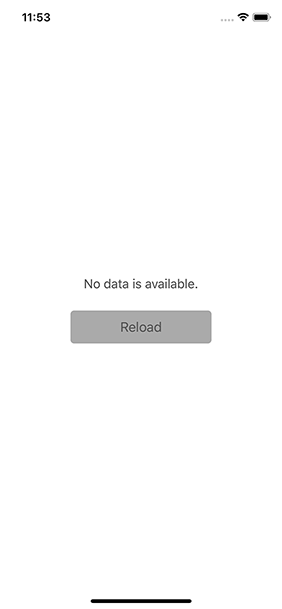

# MKTableStatusBackgroundView
> Simple drop-in class used to display useful information when your UITableView has no data.

This project was started to help developers display information on their table views when no data is available. It's starting off really simple - 



## Installation

Drop-in:

```sh
Simply add MKTableStatusBackgroundView to your project
```

Cocoapods:

```sh
No pods until the project evolves
```

## Usage example

_Since this project is starting so small and there is no pod, there is also nothing to import. Just follow along with the example project._

MKTableStatusBackgroundView is most useful when there is no data to display or no internet connection available to fetch data.

To use MKTableStatusBackgroundView there are a few steps:

* Your UITableView must have a tableFooterView set. Otherwise empty tables will still display cell seperators.
* You must add/remove your tableView.dataSource as data becomes available/unavailable

## Known Issues

* It only works in portrait mode

## Release History

* 1.0 - Initial release

## Meta

Mike Konapelsky – mike@lehighinteractive.com

Distributed under the MIT license. See ``LICENSE`` for more information.

[My GitHub profile](https://github.com/mkonapelsky/)

## Contributing

1. Fork it (<https://github.com/mkonapelsky/MKTableStatusBackgroundView/fork>)
5. Create a new Pull Request

<!-- Markdown link & img dfn's -->
[npm-image]: https://img.shields.io/npm/v/datadog-metrics.svg?style=flat-square
[npm-url]: https://npmjs.org/package/datadog-metrics
[npm-downloads]: https://img.shields.io/npm/dm/datadog-metrics.svg?style=flat-square
[travis-image]: https://img.shields.io/travis/dbader/node-datadog-metrics/master.svg?style=flat-square
[travis-url]: https://travis-ci.org/dbader/node-datadog-metrics
[wiki]: https://github.com/yourname/yourproject/wiki
